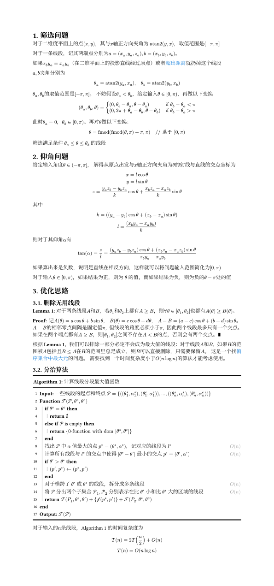

# Skymask
## Example
```py
import matplotlib.pyplot as plt
from data_reader import build_kdtree, read_shp
from visualizer import Visualizer
from skymask import np

lines, xy = read_shp("./local/Shanghai/Shanghai_Buildings_DWG-Polygon.shp")
lines = np.asarray(lines)
kdtree = build_kdtree(lines)
pos = [(xy['x_max'] + xy['x_min']) / 2, (xy['y_max'] + xy['y_min']) / 2]
theta = np.linspace(0, np.pi, num=500, endpoint=False)

fig, ax = plt.subplots(subplot_kw={'projection': 'polar'})
vis = Visualizer(fig, ax, lines, kdtree, theta, pos, dx=0.5, max_dist=1000)
fig.canvas.mpl_connect('key_press_event', vis.on_press)
plt.show()
```

## Explanation
